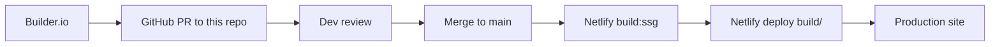
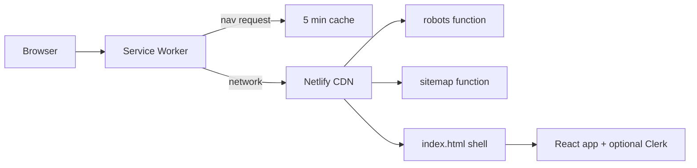

# RankBee Marketing — Vite + React + Builder.io codegen

Marketing site implemented as a Vite SPA with Builder.io codegen for UI blocks, optional Clerk auth in-app, SSG + prerender for static hosting, and an ISR-like Service Worker for 5-minute stale-while-revalidate navigation caching.

At a glance
- Vite SPA with static prerender: [prerender()](scripts/prerender.mjs:78) crawls routes from [routes.json](netlify/shared/routes.json:1) via Vite preview and Puppeteer.
- Builder.io integration: GitHub integration pushes codegen PRs into [src/imports](src/imports). Assets are referenced through figma aliasing in [vite.config.ts](vite.config.ts:20). Do not hand-edit generated files.
- Optional Clerk auth: App conditionally wraps with Clerk only if a publishable key exists; see [publishableKey](src/lib/clerk-env.ts:7) and the conditional wrap in [main.tsx](src/main.tsx:26). Safe wrappers in [clerk-safe.tsx](src/lib/clerk-safe.tsx:1) allow Builder/preview environments to build without Clerk.
- ISR-like caching: [Service Worker](public/sw.js:1) caches HTML navigations for 5 minutes, bypassing dynamic routes (/sign-in, /sign-up). Registered in [main.tsx](src/main.tsx:41).
- Netlify: SSG output is published from build/. robots and sitemap are served by Netlify Functions with environment-aware headers; see [robots handler](netlify/functions/robots.ts:3) and [sitemap handler](netlify/functions/sitemap.ts:4). SPA fallback is configured in [netlify.toml](netlify.toml:21). Preview/branch deploys set noindex headers (see [netlify.toml](netlify.toml:27)).

Directory layout
- Application: [src/](src)
  - Core SPA and routing: [App.tsx](src/App.tsx:1)
  - Entry: [main.tsx](src/main.tsx:1)
  - Auth helpers: [clerk-env.ts](src/lib/clerk-env.ts:1), [clerk-safe.tsx](src/lib/clerk-safe.tsx:1)
  - SEO helper: [Seo()](src/lib/seo.tsx:29)
  - Builder codegen (do not edit): [src/imports](src/imports)
- Static and SW: [public/sw.js](public/sw.js:1)
- Netlify functions: [netlify/functions/robots.ts](netlify/functions/robots.ts:1), [netlify/functions/sitemap.ts](netlify/functions/sitemap.ts:1)
- Routes manifest: [netlify/shared/routes.json](netlify/shared/routes.json:1)
- Build/prerender: [scripts/prerender.mjs](scripts/prerender.mjs:1)
- Config: [vite.config.ts](vite.config.ts:1), [netlify.toml](netlify.toml:1), [.env.example](.env.example:1)

Environments and runtime behavior

Local development
- Start: npm i; npm run dev
- Port: 3000 (see [vite server](vite.config.ts:66))
- Clerk: Optional; if VITE_CLERK_PUBLISHABLE_KEY is absent, the app runs without [ClerkProvider](src/main.tsx:26) using safe wrappers
- Service Worker: Explicitly unregistered in dev to avoid stale caches (see [main.tsx](src/main.tsx:46))
- Netlify Functions: Not active by default locally; robots and sitemap are only live on Netlify (or when emulated)
- Canonical/SEO: VITE_SITE_URL used by [Seo()](src/lib/seo.tsx:29)

Netlify production deploys (main)
- Build command: npm run build:ssg, publish dir build/ (see [netlify.toml](netlify.toml:1))
- SW enabled; caches HTML navigations (see [public/sw.js](public/sw.js:1))
- robots.txt and sitemap.xml served by ODB functions with CDN caching (s-maxage=3600) and indexing allowed; see [robots handler](netlify/functions/robots.ts:3) and [sitemap handler](netlify/functions/sitemap.ts:4)
- SITE_URL should be set in Netlify env to the canonical origin

Netlify deploy-preview and branch deploys
- X-Robots-Tag: noindex, nofollow via [netlify.toml](netlify.toml:27)
- robots function also disallows crawling and sets noindex as safety (see [netlify/functions/robots.ts](netlify/functions/robots.ts:8))
- SW still runs for runtime UX, but pages shouldn’t be indexed

Builder.io preview and GitHub PRs
- Designer changes land as PRs editing [src/imports](src/imports) and figma asset references (aliased in [vite.config.ts](vite.config.ts:20))
- App builds even without Clerk thanks to safe wrappers; in-app [SignInPage()](src/components/AuthPages.tsx:14) and [SignUpPage()](src/components/AuthPages.tsx:29) render correctly when configured, or use placeholders without a key

Routing and pages
- SPA routing lives in [App.tsx](src/App.tsx:1)
  - path mapping: [pathToPage()](src/App.tsx:16) derives the page id from location
  - history sync and setter: see navigation updates around [App.tsx](src/App.tsx:52)
  - SEO per route: meta map starting at [App.tsx](src/App.tsx:108), rendered via [Seo()](src/lib/seo.tsx:29)
- Sitemap excludes auth routes in [sitemap handler](netlify/functions/sitemap.ts:47)

Adding a new route
- Add the view component under [src/components](src/components)
- Update [pathToPage()](src/App.tsx:16) and the SEO meta map at [App.tsx](src/App.tsx:108)
- Add the route path to [routes.json](netlify/shared/routes.json:1) so prerender and sitemap include it
- Rebuild: npm run build:ssg

Service Worker “ISR” behavior
- Scope: Only navigation requests (HTML) are cached; assets use the browser/host defaults (see [isNavigationRequest()](public/sw.js:26))
- TTL: 5 minutes via [TTL_MS](public/sw.js:6)
- Bypass: /sign-in and /sign-up (see [public/sw.js](public/sw.js:7))
- Registration: Only in production builds (see [main.tsx](src/main.tsx:41))
- Debugging: In Chrome devtools → Application → Service Workers → Unregister. For local dev, SW is auto-unregistered.

Static site generation (SSG) and prerender
- Build steps: npm run build:ssg
  - build: Vite builds to build/
  - prerender: launches Vite preview and crawls all routes from [routes.json](netlify/shared/routes.json:1) using Puppeteer, then writes static html files to build/
- Script entrypoints in [scripts/prerender.mjs](scripts/prerender.mjs:1)
  - Reads route list: [readRoutes()](scripts/prerender.mjs:38)
  - Starts preview server: [startPreview()](scripts/prerender.mjs:45)
  - Prerenders each route: [prerender()](scripts/prerender.mjs:78)

Builder.io codegen workflow
- Source of truth: Designers work in Builder, which pushes GitHub PRs into this repository
- Generated code lives in:
  - Components and sections: [src/imports](src/imports)
  - Asset references via figma aliases: see [vite.config.ts](vite.config.ts:20)
- Do not edit generated code directly. If you need behavior, wrap it with hand-written components in [src/components](src/components) and compose or prop-drill as needed.
- PR review checklist
  - Pull the PR locally, npm i, npm run dev. Smoke test: navigation, hero, Builder components under [src/imports](src/imports)
  - Run npm run build:ssg and preview build/ (npm run start) to validate prerender and SW registration
  - Confirm no broken figma asset aliases (see [vite.config.ts](vite.config.ts:20))
  - If designers added new navigable pages, update [App.tsx](src/App.tsx:1) routing and [routes.json](netlify/shared/routes.json:1)
  - Ensure no generated files were hand-edited; push any required wrapper code to [src/components](src/components)

Environment variables

Client (Vite) — see [.env.example](.env.example:1)
- VITE_CLERK_PUBLISHABLE_KEY: Clerk publishable key
- VITE_APP_URL: Dashboard URL for “View Your Dashboard”
- VITE_ONBOARD_URL: Onboarding URL (absolute or path)
- VITE_SITE_URL: Canonical origin used by [Seo()](src/lib/seo.tsx:29)
- Optional VITE_SIGN_IN_URL: only if you must override sign-in location during local dev

Server (Netlify Functions) — set in Netlify UI
- SITE_URL: Canonical origin for robots/sitemap; used by [robots handler](netlify/functions/robots.ts:3) and [sitemap handler](netlify/functions/sitemap.ts:4)

Commands
- Dev: npm run dev
- Build: npm run build
- Prerender: npm run prerender
- Full SSG: npm run build:ssg
- Serve build: npm run start (serves build/ at http://localhost:8080)

Netlify specifics
- SPA fallback: route all paths to index.html (see [netlify.toml](netlify.toml:21))
- Functions are wrapped with ODB builder() to enable CDN caching

What works where

Auth UI
- Local dev with key: Full Clerk flows, in-app pages [SignInPage()](src/components/AuthPages.tsx:14), [SignUpPage()](src/components/AuthPages.tsx:29)
- Local dev without key and Builder previews: Safe wrappers render unsigned experience; auth components show placeholders
- Netlify: Full flows if VITE_CLERK_PUBLISHABLE_KEY is set in the deploy

SEO and indexing
- Production: indexable; robots and sitemap served by functions with CDN caching
- Preview/branch: noindex via [netlify.toml](netlify.toml:27) and function headers

Caching
- Dev: SW unregistered
- Preview/prod: SW caches HTML navigations for 5 minutes; dynamic routes bypass

Troubleshooting
- Seeing stale pages
  - In dev, SW is auto-unregistered; if testing a production build locally, open Chrome devtools → Application → Service Workers → Unregister; clear Cache Storage for the site
- Clerk errors like “MissingClerkProvider”
  - Verify VITE_CLERK_PUBLISHABLE_KEY is set and the app is wrapped (see [main.tsx](src/main.tsx:26))
- New page not appearing in sitemap or prerender
  - Update [routes.json](netlify/shared/routes.json:1) and route mapping/meta in [App.tsx](src/App.tsx:16) and [App.tsx](src/App.tsx:108), then npm run build:ssg

Security
- Do not commit secrets. Only use the Clerk publishable key client-side; server/secret keys must never be present in this repo.

Diagrams

Caching: where it works and how the 5‑minute cycle behaves

Where the 5‑minute navigation caching applies
- Vite dev server (npm run dev): No. The service worker is explicitly unregistered in dev to avoid stale caches; see [main.tsx](src/main.tsx:54).
- Local static preview of build/ (npm run start): Yes. Any production build registers the SW on page load; see registration in [main.tsx](src/main.tsx:41).
- Netlify production (main): Yes. SW runs and applies 5‑minute caching to HTML navigations.
- Netlify deploy‑preview and branch deploys: Yes. SW runs the same as production, but indexing is disabled via headers (see [netlify.toml](netlify.toml:27)).
- Builder PR previews (served from Netlify previews): Yes. SW runs; indexing is still disabled. This improves UX performance during review while keeping previews out of search.

How the 5‑minute cycle works (per route)
1) First navigation to a route (or after cache expiry)
   - The SW uses a network‑first strategy, stamps the response time, and updates the cache; see [handleNavigationRequest()](public/sw.js:45) and the network‑first branch at [public/sw.js](public/sw.js:70).
   - The timestamp is attached via [stampWithTime()](public/sw.js:93) using an x‑sw‑cache‑time header.

2) Subsequent navigations within 5 minutes
   - If a cached entry exists and its age is less than [TTL_MS](public/sw.js:6), the SW serves the cached HTML immediately and revalidates in the background; see background [revalidate()](public/sw.js:83).

3) After 5 minutes
   - The SW switches back to network‑first. If the network succeeds, it stamps and refreshes the cache; if it fails and a stale cache exists, it returns the stale copy. This preserves availability while preferring fresh content.

What is cached vs not cached
- Cached: Only navigation requests (HTML shell). This is detected via [isNavigationRequest()](public/sw.js:26). Each route is cached independently with its own TTL.
- Not cached by the SW:
  - Assets (JS, CSS, images) — handled by the browser/CDN defaults.
  - API or dynamic endpoints — not treated as navigations, so ignored by the SW.
  - Auth pages (/sign‑in, /sign‑up) — always bypass the cache and go straight to network; see [DYNAMIC_BYPASS](public/sw.js:7).

Interaction with Netlify CDN and functions
- The SW is a browser‑side cache for HTML navigations. It does not change CDN behavior for assets or functions.
- robots.txt and sitemap.xml are served by Netlify Functions with their own CDN caching (s‑maxage) and headers; see [robots handler](netlify/functions/robots.ts:3) and [sitemap handler](netlify/functions/sitemap.ts:4). These are not cached by the SW because they are not navigation requests.

npm scripts explained

All scripts are defined in [package.json](package.json). This section explains what each does, what it relies on, and when to use it.

- dev → vite
  - Launches the Vite dev server with hot reload.
  - Port and behavior:
    - Port: 3000 (see [vite server config](vite.config.ts:67)); browser auto-opens (see [vite.config.ts](vite.config.ts:68)).
    - Service Worker: explicitly unregistered in dev to avoid stale caches (see [main.tsx](src/main.tsx:54)).
    - Dev-only env debug logs confirm VITE_CLERK_PUBLISHABLE_KEY visibility (see [main.tsx](src/main.tsx:1)).
  - Use when actively developing; fastest feedback loop.

- build → vite build
  - Produces a production client bundle into build/ (see Vite outDir in [vite.config.ts](vite.config.ts:64)).
  - Does not prerender HTML; you’ll have an index.html shell and assets, but route HTML files are not yet generated.
  - Use when you want only the production bundle without static prerendering.

- prerender → node scripts/prerender.mjs
  - Runs the static prerenderer that:
    - Launches a temporary preview server via [startPreview()](scripts/prerender.mjs:45) on port PRERENDER_PORT (defaults to 4173; see [PRERENDER_PORT](scripts/prerender.mjs:11)).
    - Waits for the preview server to be ready via [waitForServer()](scripts/prerender.mjs:19).
    - Reads the list of routes from [routes.json](netlify/shared/routes.json:1) via [readRoutes()](scripts/prerender.mjs:38).
    - Visits each route with Puppeteer and writes a fully rendered HTML file into [BUILD_DIR](scripts/prerender.mjs:14) using [routeToOutPath()](scripts/prerender.mjs:68) and [ensureDirForFile()](scripts/prerender.mjs:74).
    - Stamps output with a comment “prerendered by scripts/prerender.mjs” (see [scripts/prerender.mjs](scripts/prerender.mjs:107)).
  - Use to generate static HTML for routes after a build.

- build:ssg → npm run build && npm run prerender
  - Runs a full production build and then prerenders the routes manifest.
  - This is the canonical “produce deployable static site” command.
  - Netlify uses this in CI/CD (see build command in [netlify.toml](netlify.toml:2)).

- start → npx serve build -s -l 8080
  - Serves the built static site locally from the build/ directory on port 8080, with SPA fallback enabled (-s).
  - Because it serves a production build, the Service Worker will register (see [main.tsx](src/main.tsx:41)) and apply the 5‑minute navigation caching rules described above.
  - Use to locally verify the final production output, prerendered pages, and SW behavior.

Common flows
- Day-to-day dev: npm run dev
- Verify production output (static + SW): npm run build:ssg, then npm run start
- Add or remove a route:
  - Update routing and SEO in [App.tsx](src/App.tsx:16) and [App.tsx](src/App.tsx:108)
  - Update the prerender/sitemap list in [routes.json](netlify/shared/routes.json:1)
  - Run npm run build:ssg and verify with npm run start
