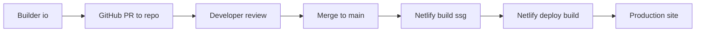
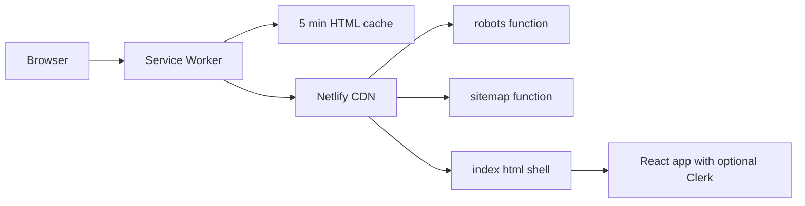

# RankBee Marketing — Vite + React + Builder.io codegen

Marketing site implemented as a Vite SPA with Builder.io codegen for UI blocks, optional Clerk auth in-app, static generation (build + prerender), and an ISR-like Service Worker that applies 5-minute stale-while-revalidate caching to HTML navigations. Netlify functions serve robots and sitemap with CDN caching. GTM, PostHog, and Intercom are integrated via client-side envs.

At a glance
- Vite SPA with static prerender: [prerender()](scripts/prerender.mjs:78) crawls routes from [routes.json](netlify/shared/routes.json:1) via Vite preview and Puppeteer.
- Builder.io integration: Designer PRs land in [src/imports](src/imports). Figma asset references are aliased in [vite.config.ts](vite.config.ts:20). Do not hand-edit generated files
- Optional Clerk auth: App wraps in Clerk only if a key is present; see [publishableKey](src/lib/clerk-env.ts:7) and conditional provider in [main.tsx](src/main.tsx:75). Safe wrappers in [clerk-safe.tsx](src/lib/clerk-safe.tsx:1) allow building without Clerk.
- ISR-like caching: [Service Worker](public/sw.js:1) caches HTML navigations for 5 minutes with background revalidation; dynamic auth routes bypass. Registered in [main.tsx](src/main.tsx:92) and unregistered in dev in [main.tsx](src/main.tsx:96).
- Netlify: SSG output is published from build/. robots and sitemap are served by Netlify Functions; see [robots handler](netlify/functions/robots.ts:3) and [sitemap handler](netlify/functions/sitemap.ts:1). SPA fallback in [netlify.toml](netlify.toml:21). Preview/branch deploys set noindex via [netlify.toml](netlify.toml:27).
- Analytics: GTM initialized at runtime in [main.tsx](src/main.tsx:33) with helpers in [gtm.ts](src/lib/gtm.ts:1). PostHog is optional via [initPostHog()](src/lib/posthog.ts:22). Intercom gated by VITE_APP_ENV in [IntercomClient](src/components/IntercomClinet.tsx:12).

Directory layout
- Application: [src/](src)
  - Root SPA and routing: [App.tsx](src/App.tsx:1)
  - Entry: [main.tsx](src/main.tsx:1)
  - Auth helpers: [clerk-env.ts](src/lib/clerk-env.ts:1), [clerk-safe.tsx](src/lib/clerk-safe.tsx:1)
  - SEO helper: [Seo()](src/lib/seo.tsx:29)
  - Builder codegen (do not edit): [src/imports](src/imports)
- Static/SW: [public/sw.js](public/sw.js:1)
- Netlify functions: [netlify/functions/robots.ts](netlify/functions/robots.ts:1), [netlify/functions/sitemap.ts](netlify/functions/sitemap.ts:1)
- Routes manifest: [netlify/shared/routes.json](netlify/shared/routes.json:1)
- Build/prerender: [scripts/prerender.mjs](scripts/prerender.mjs:1)
- Config: [vite.config.ts](vite.config.ts:1), [netlify.toml](netlify.toml:1), [.env.example](.env.example:1)

Quickstart
- Install and run dev
  - npm i
  - npm run dev
  - Port: 3000 (see [server.port](vite.config.ts:67))
  - SW is auto-unregistered in dev (see [main.tsx](src/main.tsx:96))
- Build and static preview
  - npm run build:ssg
  - npm run start (serves build/ at http://localhost:8080; SW registers in prod, see [main.tsx](src/main.tsx:92))
- Netlify deploy
  - Build command: npm run build:ssg, publish dir: build/ (see [netlify.toml](netlify.toml:1))

Routing and pages
- SPA routing lives in [App.tsx](src/App.tsx:1)
  - Map path → page id: [pathToPage()](src/App.tsx:21)
  - Navigate and pushState: [setPage](src/App.tsx:69)
  - Back/forward sync: [popstate handler](src/App.tsx:84)
  - Per-route SEO map: [metaByPage](src/App.tsx:153), rendered via [Seo()](src/lib/seo.tsx:29)
- Auth pages: [SignInPage()](src/components/AuthPages.tsx:14), [SignUpPage()](src/components/AuthPages.tsx:29)
- Sitemap excludes auth routes in [sitemap handler](netlify/functions/sitemap.ts:47)

Adding a new route
- Add the view under [src/components](src/components)
- Update [pathToPage()](src/App.tsx:21) and the SEO meta map at [App.tsx](src/App.tsx:153)
- Add the route path to [routes.json](netlify/shared/routes.json:1) so prerender and sitemap include it
- Rebuild: npm run build:ssg

Static site generation (SSG) and prerender
- Build steps: npm run build:ssg
  - build: Vite builds to build/ (see [outDir](vite.config.ts:64))
  - prerender: launches Vite preview and crawls all routes from [routes.json](netlify/shared/routes.json:1) using Puppeteer, then writes static HTML files under build/
- Script entrypoints in [scripts/prerender.mjs](scripts/prerender.mjs:1)
  - Read routes: [readRoutes()](scripts/prerender.mjs:38)
  - Start preview server: [startPreview()](scripts/prerender.mjs:45) on [PRERENDER_PORT](scripts/prerender.mjs:11)
  - Wait for server: [waitForServer()](scripts/prerender.mjs:19)
  - Out path per route: [routeToOutPath()](scripts/prerender.mjs:68)
  - Ensure dirs: [ensureDirForFile()](scripts/prerender.mjs:74)
  - Crawl/write each route: [prerender()](scripts/prerender.mjs:78)

Service Worker “ISR” behavior
- What is cached
  - Only navigation requests (HTML shell). See [isNavigationRequest()](public/sw.js:26).
  - Per-route TTL of 5 minutes via [TTL_MS](public/sw.js:6).
- Strategy
  - On request: network-first with cache update and stale fallback; see [handleNavigationRequest()](public/sw.js:45).
  - Within 5 minutes: serve cached immediately and revalidate in background; see [revalidate()](public/sw.js:83).
  - After 5 minutes: network-first again; if network fails, serve stale.
- Bypass
  - /sign-in and /sign-up bypass SW cache; see [DYNAMIC_BYPASS](public/sw.js:7).
- Registration
  - Production only: [register](src/main.tsx:92)
  - Dev: always unregistered: [unregister](src/main.tsx:96)
- Stamping and freshness
  - Cached responses are stamped with x-sw-cache-time; see [stampWithTime()](public/sw.js:93).
- Clearing or invalidating
  - Chrome devtools → Application → Service Workers → Unregister; clear Cache Storage.
  - Bump [CACHE_NAME](public/sw.js:5) if the caching logic changes.

How caching behaves across scripts and environments
- npm run dev
  - Vite dev server on port 3000 (see [vite server](vite.config.ts:67)).
  - SW explicitly unregistered; no navigation caching; see [main.tsx](src/main.tsx:96).
- npm run build
  - Produces production bundle into build/ (see [outDir](vite.config.ts:64)).
  - No prerendered route HTML yet (only index.html and assets).
- npm run prerender
  - Launches Vite preview and crawls routes; writes HTML to build/ (see [prerender()](scripts/prerender.mjs:78)).
  - Runtime SW cache does not influence static HTML output.
- npm run build:ssg
  - build + prerender; canonical way to produce a deployable static site in build/.
- npm run start
  - Serves build/ at http://localhost:8080 with SPA fallback.
  - Because this is a production build, the SW registers and applies 5-minute navigation caching (see [main.tsx](src/main.tsx:92), [TTL_MS](public/sw.js:6)).
- Netlify production (main)
  - SW active for browser navigation caching.
  - Functions cached at CDN for 1h with SWR; see [robots Cache-Control](netlify/functions/robots.ts:28), [sitemap Cache-Control](netlify/functions/sitemap.ts:70).
  - SITE_URL should be set to the canonical origin.
- Netlify deploy-preview and branch deploys
  - SW still active for UX, but indexing is disabled via [netlify.toml](netlify.toml:27) and [robots headers](netlify/functions/robots.ts:30).
  - Sitemap excludes auth routes; see [sitemap](netlify/functions/sitemap.ts:47).

Builder.io codegen workflow
- Source of truth: Designers work in Builder; PRs land in [src/imports](src/imports).
- Figma asset references map via aliases in [vite.config.ts](vite.config.ts:20).
- Do not edit generated code. Wrap behavior in hand-written components in [src/components](src/components).
- PR review checklist
  - Pull PR, npm i, npm run dev. Smoke test navigation and Builder components under [src/imports](src/imports).
  - Run npm run build:ssg and preview build/ (npm run start) to validate prerender and SW behavior.
  - Confirm figma alias resolution (see [vite.config.ts](vite.config.ts:20)).
  - If new pages are navigable, update routing and SEO in [App.tsx](src/App.tsx:21) and [App.tsx](src/App.tsx:153); add paths to [routes.json](netlify/shared/routes.json:1).

Auth (optional Clerk)
- Conditional provider only if [publishableKey](src/lib/clerk-env.ts:7) exists; see [main.tsx](src/main.tsx:75).
- Safe wrappers support running without Clerk (Builder previews, local without key): [clerk-safe.tsx](src/lib/clerk-safe.tsx:1).
- Standalone pages: [SignInPage()](src/components/AuthPages.tsx:14), [SignUpPage()](src/components/AuthPages.tsx:29).
- Default redirects: after sign-in → “/”; after sign-up → [onboardRedirectUrl](src/lib/clerk-env.ts:18).

Analytics
- Google Tag Manager
  - Runtime init: [main.tsx](src/main.tsx:33).
  - GTM ID selected by [getGTMId()](src/lib/gtm.ts:27) using VITE_APP_ENV:
    - production → VITE_GTM_ID_PROD
    - any other value → VITE_GTM_ID_STG
  - Track events via [trackEvent()](src/lib/gtm.ts:160) and page views via [trackPageView()](src/lib/gtm.ts:146).
  - Clerk context enrichment via [useGTMClerkSync()](src/lib/gtm.ts:111).
- PostHog (optional)
  - Initialize via [initPostHog()](src/lib/posthog.ts:22). Requires VITE_POSTHOG_KEY and VITE_POSTHOG_HOST.
  - Track events via [trackEvent()](src/lib/posthog.ts:90).
  - Clerk sync via [usePostHogClerkSync()](src/lib/posthog.ts:135).
- Intercom (optional)
  - Loaded conditionally for VITE_APP_ENV ∈ {production, preprod} in [IntercomClient](src/components/IntercomClinet.tsx:12).
  - App ID: VITE_INTERCOM_APP_ID.
  - Signed-in users use a Clerk JWT via getToken template Intercom-session-key (no env var).

Environment variables
- Client (Vite) — see [.env.example](.env.example:1)
  - VITE_CLERK_PUBLISHABLE_KEY: Clerk publishable key
  - VITE_APP_URL: Dashboard URL for “View Your Dashboard”
  - VITE_ONBOARD_URL: Onboarding destination (absolute or path)
  - VITE_SITE_URL: Canonical origin used by [Seo()](src/lib/seo.tsx:29)
  - VITE_APP_ENV: environment tag used by analytics/Intercom logic (e.g., production, preprod, staging, development)
  - VITE_GTM_ID_STG / VITE_GTM_ID_PROD: GTM container IDs used by [getGTMId()](src/lib/gtm.ts:27)
  - VITE_POSTHOG_KEY / VITE_POSTHOG_HOST: PostHog credentials for [initPostHog()](src/lib/posthog.ts:22)
  - VITE_INTERCOM_APP_ID: Intercom app id used by [IntercomClient](src/components/IntercomClinet.tsx:17)
- Server (Netlify Functions) — set in Netlify UI
  - SITE_URL: Canonical origin for robots/sitemap; used by [robots handler](netlify/functions/robots.ts:3) and [sitemap handler](netlify/functions/sitemap.ts:8)
  - CONTEXT is provided by Netlify (production | deploy-preview | branch-deploy | dev)

Commands
- Dev: npm run dev
- Build: npm run build
- Prerender: npm run prerender
- Full SSG: npm run build:ssg
- Serve build: npm run start (serves build/ at http://localhost:8080)

## DigitalOcean App Platform (Static Site)

This project deploys as a static site on DigitalOcean App Platform. Netlify-specific files (netlify.toml, Netlify Functions) are not used by DigitalOcean and can be kept for optional Netlify deploys or removed if you prefer.

Build and output
- Build command: npm ci && npm run build:ssg
- Output directory: build/
- Node version: 18+ (20.x recommended)

Environment variables (set in App Platform → Settings → Environment Variables)
- VITE_SITE_URL: Your canonical origin (e.g., https://rankbee.ai). Used by SEO tags and by the build-time generator.
- VITE_APP_ENV: production for production; any other value (staging, development, preprod) will emit a Disallow: / robots.txt to avoid indexing.
- Optional fallbacks (also read by the generator):
  - SITE_URL: Alternative to VITE_SITE_URL if you prefer a non-Vite name in CI.
  - APP_ENV: Alternative to VITE_APP_ENV. NODE_ENV is also considered.

Static robots.txt and sitemap.xml
- Generated at build time into build/robots.txt and build/sitemap.xml by scripts/generate-seo.mjs (wired into npm run build:ssg).
- Routes source: netlify/shared/routes.json (keep this file up to date when adding pages).
- Preview vs production:
  - VITE_APP_ENV=production → Allow indexing + Sitemap header.
  - Any other value → Disallow all.
- Caching headers are not embedded (served as static files). Use DigitalOcean CDN/Edge rules if you need custom Cache-Control on these files.

SPA routing (client-side)
- Deep links require serving index.html for unknown paths.
- Recommended: In App Platform component settings for your static site, set Error Document to /index.html. This makes all not-found paths load the SPA shell.
- Alternative: Provide a 404.html that loads your SPA and redirects, but setting Error Document is cleaner.

What’s unused on DigitalOcean
- netlify.toml: Redirects, SPA fallback, and function routes are Netlify-specific.
- netlify/functions/*: Replaced by build-time generation for robots and sitemap.

Local verification
- npm run build:ssg
- Confirm that build/robots.txt and build/sitemap.xml exist and contain the expected values for your VITE_SITE_URL and VITE_APP_ENV.
Netlify specifics
- SPA fallback: route all paths to index.html (see [netlify.toml](netlify.toml:21))
- robots.txt and sitemap.xml are served by ODB functions with CDN caching:
  - robots: [Cache-Control](netlify/functions/robots.ts:28)
  - sitemap: [Cache-Control](netlify/functions/sitemap.ts:70)
- Preview/branch deploys set noindex via [netlify.toml](netlify.toml:27); robots also adds X-Robots-Tag on previews (see [robots.ts](netlify/functions/robots.ts:30))

Troubleshooting
- Seeing stale pages
  - In dev, SW is unregistered; for production builds, open Chrome devtools → Application → Service Workers → Unregister; clear Cache Storage.
  - If you changed SW logic, bump [CACHE_NAME](public/sw.js:5).
- Clerk “MissingClerkProvider”
  - Verify VITE_CLERK_PUBLISHABLE_KEY and the conditional provider in [main.tsx](src/main.tsx:75).
- New page not in sitemap or prerendered
  - Update [routes.json](netlify/shared/routes.json:1) and routing/meta in [App.tsx](src/App.tsx:21) and [App.tsx](src/App.tsx:153), then npm run build:ssg.

Diagrams

Caching: where it works and how the 5‑minute cycle behaves
- Where the 5‑minute navigation caching applies
  - Vite dev server (npm run dev): No; SW auto-unregistered; see [main.tsx](src/main.tsx:96).
  - Local static preview of build/ (npm run start): Yes; SW registers on load; see [main.tsx](src/main.tsx:92).
  - Netlify production (main): Yes; SW active; 5-minute nav caching.
  - Netlify deploy‑preview and branch: Yes; SW active for UX, but noindex by headers.
- How the 5‑minute cycle works (per route)
  1) First navigation or after TTL expiry: network-first, stamp, cache; see [handleNavigationRequest()](public/sw.js:45), [stampWithTime()](public/sw.js:93).
  2) Navigations within 5 minutes: serve cached immediately; revalidate in background; see [revalidate()](public/sw.js:83).
  3) After 5 minutes: network-first again; fallback to stale if network fails.

Security
- Do not commit secrets. Only publishable (public) keys belong in Vite env files. Server/secret keys must not be present in this repo.
